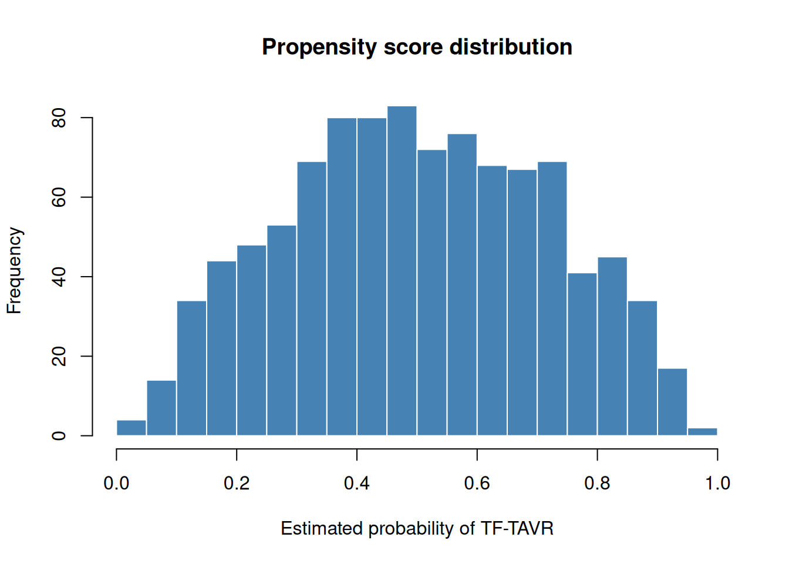

# Introduction to hvtiPropensityScores

## 1 Overview

`hvtiPropensityScores` provides propensity score methods for cardiac
surgery comparative-effectiveness research. It ports the balancing logic
from six SAS templates into a tidy R API compatible with
[hvtiPlotR](https://ehrlinger.github.io/hvtiPlotR/).

The package covers the full workflow from raw covariates to sensitivity
analysis:

1.  **Estimate a balancing score** —
    [`ps_logistic()`](https://ehrlinger.github.io/hvtiPropensityScores/reference/ps_logistic.md),
    [`ps_ordinal()`](https://ehrlinger.github.io/hvtiPropensityScores/reference/ps_ordinal.md),
    [`ps_nominal()`](https://ehrlinger.github.io/hvtiPropensityScores/reference/ps_nominal.md),
    [`bs_continuous()`](https://ehrlinger.github.io/hvtiPropensityScores/reference/bs_continuous.md),
    [`bs_count()`](https://ehrlinger.github.io/hvtiPropensityScores/reference/bs_count.md)
2.  **Balance treatment groups** —
    [`ps_match()`](https://ehrlinger.github.io/hvtiPropensityScores/reference/ps_match.md)
    (nearest-neighbour matching) or
    [`ps_weight()`](https://ehrlinger.github.io/hvtiPropensityScores/reference/ps_weight.md)
    (IPTW)
3.  **Diagnose balance** — SMD tables, group counts, and overlap
    diagnostics in `$tables`,
    [`sa_overlap()`](https://ehrlinger.github.io/hvtiPropensityScores/reference/sa_overlap.md)
4.  **Assess sensitivity to unmeasured confounding** —
    [`sa_rosenbaum()`](https://ehrlinger.github.io/hvtiPropensityScores/reference/sa_rosenbaum.md),
    [`sa_evalue()`](https://ehrlinger.github.io/hvtiPropensityScores/reference/sa_evalue.md),
    [`sa_overlap()`](https://ehrlinger.github.io/hvtiPropensityScores/reference/sa_overlap.md),
    [`sa_trim_sweep()`](https://ehrlinger.github.io/hvtiPropensityScores/reference/sa_trim_sweep.md)

All score and balance objects share a common `ps_data` S3 base class
whose `$data` slot carries the original dataset with appended columns,
`$meta` holds run parameters, and `$tables` carries SMD and group-count
diagnostics.

------------------------------------------------------------------------

## 2 Sample data

[`sample_ps_data()`](https://ehrlinger.github.io/hvtiPropensityScores/reference/sample_ps_data.md)
generates a synthetic cardiac-surgery dataset that mimics a typical SAS
export: two treatment arms (SAVR / TF-TAVR), several continuous and
binary covariates, a fitted propensity score (`prob_t`), and a `match`
indicator initialised to `0`.

``` r
dta <- sample_ps_data(n = 500, seed = 42)
head(dta)
#>   id tavr      age female       ef diabetes hypertension    prob_t match
#> 1  1    0 88.96767      1 35.91940        0            1 0.1072885     0
#> 2  2    0 73.48241      0 32.50216        1            0 0.2258719     0
#> 3  3    0 80.90503      1 48.59300        0            1 0.3249308     0
#> 4  4    0 83.06290      0 53.74726        0            1 0.2872581     0
#> 5  5    0 81.23415      0 29.22222        1            1 0.0920883     0
#> 6  6    0 77.15100      0 54.90524        0            0 0.4674866     0
```

``` r
table(dta$tavr)
#> 
#>   0   1 
#> 500 500
summary(dta$prob_t)
#>    Min. 1st Qu.  Median    Mean 3rd Qu.    Max. 
#> 0.03556 0.34004 0.49508 0.50000 0.67026 0.95645
```

The two treatment groups differ on all covariates — younger patients
with higher ejection fraction were more likely to receive TF-TAVR — so
the raw SMDs are non-trivial and the propensity scores have good
overlap.

``` r
hist(
  dta$prob_t,
  breaks = 30,
  main   = "Propensity score distribution",
  xlab   = "Estimated probability of TF-TAVR",
  col    = "steelblue",
  border = "white"
)
```



------------------------------------------------------------------------

## 3 Propensity score estimation

### 3.1 Binary treatment — `ps_logistic()`

In practice a propensity score is estimated from covariates before
matching or weighting.
[`ps_logistic()`](https://ehrlinger.github.io/hvtiPropensityScores/reference/ps_logistic.md)
fits `stats::glm(..., family = binomial())` and appends several columns
that mirror the original SAS template output:

| R column   | SAS equivalent     | Description                                             |
|------------|--------------------|---------------------------------------------------------|
| `prob_t`   | `_p_` / `_propen_` | Propensity score (probability of treatment)             |
| `logit_t`  | `_logit_`          | Log-odds: `log(p / (1 - p))`                            |
| `mt_wt`    | `mt_wt`            | Matching weight `min(p, 1-p) / (p·trt + (1-p)·(1-trt))` |
| `quintile` | `quintile`         | Rank-based quintile (1–5)                               |
| `decile`   | `decile`           | Rank-based decile (1–10)                                |

``` r
obj_ps <- ps_logistic(
  tavr ~ age + female + ef + diabetes + hypertension,
  data = sample_ps_data(n = 500, seed = 42)
)
print(obj_ps)
#> <ps_logistic>
#>   N total     : 1000
#>   Treatment   : tavr
#>   PS column   : prob_t
#>   Weight col  : mt_wt
#>   Method      : logistic
#>   Tables      : smd, group_counts
```

The scored dataset can be passed directly to
[`ps_match()`](https://ehrlinger.github.io/hvtiPropensityScores/reference/ps_match.md)
or
[`ps_weight()`](https://ehrlinger.github.io/hvtiPropensityScores/reference/ps_weight.md).

``` r
head(obj_ps$data[, c("id", "tavr", "prob_t", "logit_t", "mt_wt",
                      "quintile", "decile")])
#>   id tavr    prob_t    logit_t     mt_wt quintile decile
#> 1  1    0 0.1072885 -2.1187424 0.1201827        1      1
#> 2  2    0 0.2258719 -1.2317694 0.2917758        1      2
#> 3  3    0 0.3249308 -0.7312031 0.4813295        2      3
#> 4  4    0 0.2872581 -0.9087381 0.4030325        1      2
#> 5  5    0 0.0920883 -2.2883993 0.1014287        1      1
#> 6  6    0 0.4674866 -0.1302375 0.8778869        3      5
```

``` r
m_from_ps <- ps_match(obj_ps$data,
                      score_col = obj_ps$meta$score_col,
                      seed      = 42)
print(m_from_ps)
#> <ps_match>
#>   N total     : 1000
#>   Treatment   : tavr
#>   PS column   : prob_t
#>   Method      : nearest-neighbour 1:1
#>   Tables      : smd_before, smd_after, group_counts_before, group_counts_after
```

### 3.2 Multiply-imputed data

The SAS template fits the model separately on each imputed dataset
(`PROC LOGISTIC ... BY _IMPUTATION_`) and averages predicted
probabilities with `PROC SUMMARY mean=`. Pass a stacked long-format MI
data frame and set `imputation_col` to replicate this.

``` r
dta_base <- sample_ps_data(n = 300, seed = 10)

# Simulate two imputed datasets stacked with an imputation index column
dta_mi <- rbind(cbind(dta_base, imp = 1L),
                cbind(dta_base, imp = 2L))

obj_mi <- ps_logistic(
  tavr ~ age + female + ef + diabetes + hypertension,
  data           = dta_mi,
  imputation_col = "imp",
  id_col         = "id"
)
print(obj_mi)
#> <ps_logistic>
#>   N total     : 600
#>   Treatment   : tavr
#>   PS column   : prob_t
#>   Weight col  : mt_wt
#>   Method      : logistic-MI (2 imputations)
#>   Tables      : smd, group_counts

# Per-patient PS is averaged across imputations, matching PROC SUMMARY mean=
summary(obj_mi$data$prob_t)
#>    Min. 1st Qu.  Median    Mean 3rd Qu.    Max. 
#> 0.02227 0.30987 0.48499 0.50000 0.68398 0.94193
```

### 3.3 Ordinal treatment — `ps_ordinal()`

For ordered treatment variables (e.g. NYHA functional class I / II /
III–IV),
[`ps_ordinal()`](https://ehrlinger.github.io/hvtiPropensityScores/reference/ps_ordinal.md)
fits a proportional-odds cumulative logit model via
[`MASS::polr()`](https://rdrr.io/pkg/MASS/man/polr.html), equivalent to
the default `PROC LOGISTIC` behaviour for ordinal responses in SAS.

The SAS template decomposes cumulative probabilities into marginal
probabilities: `p1 = col1; p2 = col2 - col1; p3 = 1 - col2`.
[`ps_ordinal()`](https://ehrlinger.github.io/hvtiPropensityScores/reference/ps_ordinal.md)
performs this decomposition internally, appending one `prob_<level>`
column per level.

``` r
dta_ord <- sample_ps_data_ordinal(n = 400, seed = 1)
obj_ord  <- ps_ordinal(
  nyha_grp ~ age + female + ef + diabetes,
  data = dta_ord
)
print(obj_ord)
#> <ps_ordinal>
#>   N total     : 1200
#>   Treatment   : nyha_grp (3 levels: I < II < III)
#>   Score cols  : prob_I, prob_II, prob_III
#>   Method      : ordinal-logistic
#>   Tables      : group_counts

# One marginal probability column per level
head(obj_ord$data[, c("id", "nyha_grp",
                       obj_ord$meta$score_cols)])
#>   id nyha_grp    prob_I   prob_II   prob_III
#> 1  1        I 0.4584473 0.4212689 0.12028379
#> 2  2        I 0.7563215 0.2077266 0.03595197
#> 3  3        I 0.6806248 0.2678598 0.05151538
#> 4  4        I 0.3226796 0.4818512 0.19546928
#> 5  5        I 0.5326507 0.3751548 0.09219450
#> 6  6        I 0.4606336 0.4200110 0.11935539

# Quintile distribution (ordered by P(highest level) as in SAS)
table(obj_ord$data$quintile)
#> < table of extent 0 >
```

### 3.4 Nominal treatment — `ps_nominal()`

For unordered multi-level treatments (e.g. repair type: CE / COS / PER /
DEV),
[`ps_nominal()`](https://ehrlinger.github.io/hvtiPropensityScores/reference/ps_nominal.md)
fits a generalised logit model via
[`nnet::multinom()`](https://rdrr.io/pkg/nnet/man/multinom.html),
equivalent to SAS `PROC LOGISTIC ... / link=glogit`. The first factor
level is the reference category (`REF=first` in SAS); use `ref_level` to
override.

``` r
dta_nom <- sample_ps_data_nominal(n = 400, seed = 2)
obj_nom  <- ps_nominal(
  rtyp ~ age + female + ef + diabetes,
  data = dta_nom
)
print(obj_nom)
#> <ps_nominal>
#>   N total     : 1600
#>   Treatment   : rtyp (4 levels)
#>   Reference   : COS
#>   Score cols  : prob_COS, prob_PER, prob_DEV, prob_CE
#>   Method      : nominal-logistic
#>   Tables      : group_counts

# One probability column per repair type (analogous to p_cos, p_per, etc.)
head(obj_nom$data[, c("id", "rtyp", obj_nom$meta$score_cols)])
#>   id rtyp   prob_COS  prob_PER  prob_DEV    prob_CE
#> 1  1  COS 0.50033813 0.3350304 0.1284198 0.03621158
#> 2  2  COS 0.42351886 0.3367285 0.1771380 0.06261467
#> 3  3  COS 0.07381583 0.1819098 0.3116013 0.43267305
#> 4  4  COS 0.57942852 0.3120193 0.0890958 0.01945643
#> 5  5  COS 0.59403690 0.3002493 0.0874368 0.01827697
#> 6  6  COS 0.46113007 0.3270729 0.1594435 0.05235349
```

------------------------------------------------------------------------

## 4 Balancing scores for continuous and count exposures

When the “treatment” is a continuous or count variable (e.g. units of
RBC transfused, nadir haematocrit), a propensity score is undefined. The
SAS templates instead estimate a **balancing score**: the linear
predictor from a saturated model. Patients with similar balancing scores
have similar expected exposure values, enabling within-stratum
comparisons analogous to PS stratification.

### 4.1 Continuous exposure — `bs_continuous()`

Mirrors `tp.rm.continuous.balncing_score.sas` (PROC REG balancing score
on nadir HCT). The fitted value from
[`stats::lm()`](https://rdrr.io/r/stats/lm.html) is used as the score.

``` r
dta <- sample_ps_data(n = 400, seed = 5)
obj_bs <- bs_continuous(
  ef ~ age + female + diabetes + hypertension,
  data   = dta,
  id_col = "id"
)
print(obj_bs)
#> <bs_continuous>
#>   N total     : 800
#>   Outcome     : ef
#>   Score col   : bs
#>   Strata      : 10 clusters (cluster)
#>   Method      : balancing-linear
#>   Tables      : strata_counts

# Balancing score and decile-based strata
head(obj_bs$data[, c("id", "ef", "bs", "quintile", "decile", "cluster")])
#>   id       ef       bs quintile decile cluster
#> 1  1 65.29496 56.20983        4      8       8
#> 2  2 61.89769 53.32613        1      1       1
#> 3  3 68.64566 56.37077        4      8       8
#> 4  4 30.80116 54.50480        2      3       3
#> 5  5 53.41481 52.88235        1      1       1
#> 6  6 50.22194 55.33014        3      5       5

# Binary stratum indicators stra_1 ... stra_10 mirror the SAS %grp macro
table(obj_bs$data$cluster)
#> 
#>  1  2  3  4  5  6  7  8  9 10 
#> 80 80 80 80 80 80 80 80 80 80
```

### 4.2 Count exposure — `bs_count()`

Mirrors `tp.pm.count.balncing_score.sas` (PROC GENMOD dist=nb link=log).
The **linear predictor on the log scale** (`xbeta`) is used as the
balancing score, not the fitted count — the log scale is continuous and
unbounded, making it more suitable for rank-based stratification.

``` r
dta_cnt <- sample_ps_data_count(n = 400, seed = 6)

# Negative binomial to account for overdispersion (SAS dist=nb)
obj_cnt <- bs_count(
  rbc_tot ~ female + age + diabetes + hypertension,
  data = dta_cnt,
  dist = "negbin"
)
print(obj_cnt)
#> <bs_count>
#>   N total     : 400
#>   Outcome     : rbc_tot
#>   Score col   : bs
#>   Distribution: negbin
#>   Strata      : 10 clusters (cluster)
#>   Method      : balancing-negbin
#>   Tables      : strata_counts

head(obj_cnt$data[, c("id", "rbc_tot", "bs", "cluster",
                       "stra_1", "stra_2")])
#>   id rbc_tot        bs cluster stra_1 stra_2
#> 1  1       3 0.8968210       9      0      0
#> 2  2       3 0.3704176       3      0      0
#> 3  3       5 0.7345921       8      0      0
#> 4  4       2 0.9625049      10      0      0
#> 5  5       5 0.4749000       4      0      0
#> 6  6       4 0.9215424      10      0      0
```

------------------------------------------------------------------------

## 5 Propensity score matching

### 5.1 Build the matched object

[`ps_match()`](https://ehrlinger.github.io/hvtiPropensityScores/reference/ps_match.md)
performs greedy 1:1 nearest-neighbour matching without replacement.

``` r
m <- ps_match(dta)
print(m)
#> <ps_match>
#>   N total     : 800
#>   Treatment   : tavr
#>   PS column   : prob_t
#>   Method      : nearest-neighbour 1:1
#>   Tables      : smd_before, smd_after, group_counts_before, group_counts_after
```

### 5.2 Diagnostics

[`summary()`](https://rdrr.io/r/base/summary.html) prints the available
diagnostic tables.

``` r
summary(m)
#> Summary of <ps_match>
#> 
#> Smd before:
#>                  variable     smd
#> age                   age -0.7191
#> female             female  0.1005
#> ef                     ef  0.6085
#> diabetes         diabetes -0.1054
#> hypertension hypertension -0.0615
#> 
#> Smd after:
#>                  variable     smd
#> age                   age -0.7191
#> female             female  0.1005
#> ef                     ef  0.6085
#> diabetes         diabetes -0.1054
#> hypertension hypertension -0.0615
#> 
#> Group counts before:
#>     group   n
#> 1 control 400
#> 2 treated 400
#> 
#> Group counts after:
#>     group   n
#> 1 control 400
#> 2 treated 400
```

The `$tables` slot is a named list you can access directly:

``` r
m$tables$smd_before
#>                  variable     smd
#> age                   age -0.7191
#> female             female  0.1005
#> ef                     ef  0.6085
#> diabetes         diabetes -0.1054
#> hypertension hypertension -0.0615
m$tables$smd_after
#>                  variable     smd
#> age                   age -0.7191
#> female             female  0.1005
#> ef                     ef  0.6085
#> diabetes         diabetes -0.1054
#> hypertension hypertension -0.0615
```

### 5.3 Extract the matched dataset

`$data` is the *full* dataset with a `match` column set to `1` for
matched pairs. Filter to `match == 1` to obtain the matched subset.

``` r
matched <- m$data[m$data$match == 1L, ]
nrow(matched)
#> [1] 800
table(matched$tavr)
#> 
#>   0   1 
#> 400 400
```

### 5.4 Caliper matching

A caliper restricts matches to pairs whose propensity scores differ by
no more than the supplied threshold, reducing the number of matched
pairs in exchange for tighter balance.

``` r
m_cal <- ps_match(dta, caliper = 0.05)
print(m_cal)
#> <ps_match>
#>   N total     : 800
#>   Treatment   : tavr
#>   PS column   : prob_t
#>   Method      : nearest-neighbour 1:1
#>   Tables      : smd_before, smd_after, group_counts_before, group_counts_after
```

------------------------------------------------------------------------

## 6 Inverse-probability-of-treatment weighting

### 6.1 ATE weights (default)

[`ps_weight()`](https://ehrlinger.github.io/hvtiPropensityScores/reference/ps_weight.md)
computes IPTW weights and appends them to `$data`. The default estimand
is the **average treatment effect** (ATE).

``` r
w_ate <- ps_weight(dta, estimand = "ATE")
print(w_ate)
#> <ps_weight>
#>   N total     : 800
#>   Treatment   : tavr
#>   PS column   : prob_t
#>   Method      : IPTW-ATE
#>   Tables      : smd_unweighted, smd_weighted, group_counts, effective_n
```

``` r
summary(w_ate)
#> Summary of <ps_weight>
#> 
#> Smd unweighted:
#>                  variable     smd
#> id                     id  3.4598
#> age                   age -0.7191
#> female             female  0.1005
#> ef                     ef  0.6085
#> diabetes         diabetes -0.1054
#> hypertension hypertension -0.0615
#> match               match      NA
#> 
#> Smd weighted:
#>                  variable     smd
#> id                     id  3.5396
#> age                   age -0.0168
#> female             female -0.0151
#> ef                     ef  0.0474
#> diabetes         diabetes  0.0023
#> hypertension hypertension  0.0100
#> match               match      NA
#> 
#> Group counts:
#>     group   n
#> 1 control 400
#> 2 treated 400
#> 
#> Effective n:
#>     group n_effective
#> 1 control       299.6
#> 2 treated       319.2
```

The `iptw` column holds the stabilised weights.

``` r
head(w_ate$data[, c("id", "tavr", "prob_t", "iptw")])
#>   id tavr    prob_t      iptw
#> 1  1    0 0.7308849 1.8579411
#> 2  2    0 0.3245418 0.7402383
#> 3  3    0 0.7893353 2.3734402
#> 4  4    0 0.1186602 0.5673181
#> 5  5    0 0.1737956 0.6051771
#> 6  6    0 0.4025594 0.8369033
summary(w_ate$data$iptw)
#>    Min. 1st Qu.  Median    Mean 3rd Qu.    Max. 
#>  0.5090  0.6687  0.8189  0.9951  1.1024  5.9547
```

### 6.2 ATT and ATC weights

For the **average treatment effect on the treated** (ATT), treated
patients receive weight `1` and controls receive `ps / (1 - ps)`.

``` r
w_att <- ps_weight(dta, estimand = "ATT")
summary(w_att$data$iptw)
#>    Min. 1st Qu.  Median    Mean 3rd Qu.    Max. 
#> 0.01294 0.32236 0.50000 0.50193 0.50000 5.45472
```

For the **average treatment effect on the controls** (ATC), the roles
are reversed.

``` r
w_atc <- ps_weight(dta, estimand = "ATC")
summary(w_atc$data$iptw)
#>     Min.  1st Qu.   Median     Mean  3rd Qu.     Max. 
#> 0.009041 0.313837 0.500000 0.493136 0.500000 3.367004
```

### 6.3 Weight trimming (winsorisation)

Extreme weights can destabilise estimates. Supplying `trim` winsorises
weights to the (`trim`, `1 - trim`) quantile range.

``` r
w_trim <- ps_weight(dta, estimand = "ATE", trim = 0.05)
summary(w_trim$data$iptw)
#>    Min. 1st Qu.  Median    Mean 3rd Qu.    Max. 
#>  0.5691  0.6687  0.8189  0.9613  1.1024  2.0304
```

------------------------------------------------------------------------

## 7 Sensitivity analysis

Every observational study rests on the assumption of no unmeasured
confounding. The four `sa_*` functions quantify how strong an unmeasured
confounder would need to be to change the study’s conclusions.

``` r
dta  <- sample_ps_data(n = 500, seed = 42)
m    <- ps_match(dta, seed = 42)
w    <- ps_weight(dta, estimand = "ATE")
```

### 7.1 Overlap and positivity — `sa_overlap()`

Before any analysis, check that the PS distributions overlap
sufficiently.
[`sa_overlap()`](https://ehrlinger.github.io/hvtiPropensityScores/reference/sa_overlap.md)
reports the common support region, the fraction of each group outside
it, and near-positivity-violation flags.

``` r
ov <- sa_overlap(m)
ov$overlap_region
#>  lower  upper 
#> 0.0483 0.9015
ov$outside_overlap
#>     group n_outside pct_outside
#> 1 control         2         0.4
#> 2 treated        16         3.2
ov$positivity_flags
#>     group n_near_zero n_near_one pct_near_zero pct_near_one
#> 1 control           3          0           0.6          0.0
#> 2 treated           1          2           0.2          0.4
```

### 7.2 Weight-trimming sensitivity sweep — `sa_trim_sweep()`

Extreme IPTW weights inflate variance and can dominate estimates.
[`sa_trim_sweep()`](https://ehrlinger.github.io/hvtiPropensityScores/reference/sa_trim_sweep.md)
sweeps a range of winsorisation thresholds and reports how ESS and the
weight distribution change. Use this to choose a trimming level that
controls extreme weights without unacceptable loss of sample size.

``` r
sweep <- sa_trim_sweep(w, trim_seq = seq(0, 0.10, by = 0.01))
head(sweep)
#>   trim ess_control ess_treated max_weight sd_weight pct_trimmed
#> 1 0.00       398.7       341.9    10.3568    0.6014           0
#> 2 0.01       413.3       399.0     3.0547    0.4728           2
#> 3 0.02       420.9       407.3     2.6476    0.4450           4
#> 4 0.03       428.7       419.4     2.2002    0.4087           6
#> 5 0.04       431.8       424.2     2.0608    0.3939           8
#> 6 0.05       434.6       428.6     1.9526    0.3804          10

# ESS at no trimming vs. 5% trimming
sweep[sweep$trim %in% c(0, 0.05), c("trim", "ess_control",
                                      "ess_treated", "max_weight")]
#>   trim ess_control ess_treated max_weight
#> 1 0.00       398.7       341.9    10.3568
#> 6 0.05       434.6       428.6     1.9526
```

### 7.3 E-values — `sa_evalue()`

The E-value (VanderWeele & Ding 2017) is the minimum risk-ratio that an
unmeasured confounder would need with *both* the treatment and the
outcome to fully explain away the observed association. A large E-value
indicates a more robust finding.

``` r
# Suppose a matched analysis yields RR = 1.8 (95% CI 1.3 to 2.5)
ev <- sa_evalue(1.8, ci_lo = 1.3, ci_hi = 2.5, type = "RR")
ev$evalue_estimate   # confounder must be this strong to explain the RR
#> [1] 3
ev$evalue_ci         # must be this strong to explain even the CI lower bound
#> [1] 1.9245
```

``` r
# Risk difference of 0.08 with baseline outcome probability 0.15
ev_rd <- sa_evalue(0.08, ci_lo = 0.02, ci_hi = 0.14,
                   type = "RD", p0 = 0.15)
ev_rd$evalue_estimate
#> [1] 2.437644
```

### 7.4 Rosenbaum sensitivity bounds — `sa_rosenbaum()`

For matched analyses,
[`sa_rosenbaum()`](https://ehrlinger.github.io/hvtiPropensityScores/reference/sa_rosenbaum.md)
computes worst- and best-case p-value bounds for the Wilcoxon
signed-rank test under a hidden-bias parameter Γ (Rosenbaum 2002). Γ = 1
means no hidden bias; the **sensitivity value** is the largest Γ at
which the analysis remains significant.

``` r
res <- sa_rosenbaum(m, outcome_col = "ef", gamma_max = 3, gamma_inc = 0.25)

# Summary: how sensitive is the result?
res$sensitivity_value   # largest Gamma where upper p-value < 0.05
#> [1] 2
res$n_pairs
#> [1] 500

# Full bounds table
head(res$bounds)
#>   gamma      p_upper      p_lower reject_upper
#> 1  1.00 1.110223e-16 1.110223e-16         TRUE
#> 2  1.25 4.388009e-10 0.000000e+00         TRUE
#> 3  1.50 4.094436e-06 0.000000e+00         TRUE
#> 4  1.75 1.043090e-03 0.000000e+00         TRUE
#> 5  2.00 2.903425e-02 0.000000e+00         TRUE
#> 6  2.25 1.950801e-01 0.000000e+00        FALSE
```

------------------------------------------------------------------------

## 8 Downstream use with hvtiPlotR

The `$data` and `$tables` slots are designed for direct consumption by
`hvtiPlotR::hv_mirror_hist()` (weighted mode) and
`hvtiPlotR::hv_balance()`.

### 8.1 Mirror histogram (matched)

``` r
library(hvtiPlotR)

mh <- hv_mirror_hist(
  data          = m$data,
  x             = prob_t,
  treatment     = tavr,
  match_col     = match,
  group_labels  = c("SAVR", "TF-TAVR")
)
plot(mh) +
  ggplot2::scale_y_continuous(labels = abs) +
  ggplot2::labs(x = "Propensity Score", y = "Number of Patients") +
  hv_theme("manuscript")
```

### 8.2 Mirror histogram (weighted)

``` r
mh_wt <- hv_mirror_hist(
  data          = w_ate$data,
  x             = prob_t,
  treatment     = tavr,
  weight_col    = iptw,
  group_labels  = c("SAVR", "TF-TAVR")
)
plot(mh_wt) +
  ggplot2::scale_y_continuous(labels = abs) +
  ggplot2::labs(x = "Propensity Score", y = "Weighted Count") +
  hv_theme("manuscript")
```

------------------------------------------------------------------------

## 9 Session info

``` r
sessionInfo()
#> R version 4.5.3 (2026-03-11)
#> Platform: x86_64-pc-linux-gnu
#> Running under: Ubuntu 24.04.4 LTS
#> 
#> Matrix products: default
#> BLAS:   /usr/lib/x86_64-linux-gnu/openblas-pthread/libblas.so.3 
#> LAPACK: /usr/lib/x86_64-linux-gnu/openblas-pthread/libopenblasp-r0.3.26.so;  LAPACK version 3.12.0
#> 
#> locale:
#>  [1] LC_CTYPE=C.UTF-8       LC_NUMERIC=C           LC_TIME=C.UTF-8       
#>  [4] LC_COLLATE=C.UTF-8     LC_MONETARY=C.UTF-8    LC_MESSAGES=C.UTF-8   
#>  [7] LC_PAPER=C.UTF-8       LC_NAME=C              LC_ADDRESS=C          
#> [10] LC_TELEPHONE=C         LC_MEASUREMENT=C.UTF-8 LC_IDENTIFICATION=C   
#> 
#> time zone: UTC
#> tzcode source: system (glibc)
#> 
#> attached base packages:
#> [1] stats     graphics  grDevices utils     datasets  methods   base     
#> 
#> other attached packages:
#> [1] hvtiPropensityScores_0.0.0.9000
#> 
#> loaded via a namespace (and not attached):
#>  [1] MASS_7.3-65     compiler_4.5.3  fastmap_1.2.0   cli_3.6.5      
#>  [5] tools_4.5.3     htmltools_0.5.9 otel_0.2.0      nnet_7.3-20    
#>  [9] yaml_2.3.12     rmarkdown_2.31  knitr_1.51      jsonlite_2.0.0 
#> [13] xfun_0.57       digest_0.6.39   rlang_1.1.7     evaluate_1.0.5
```
